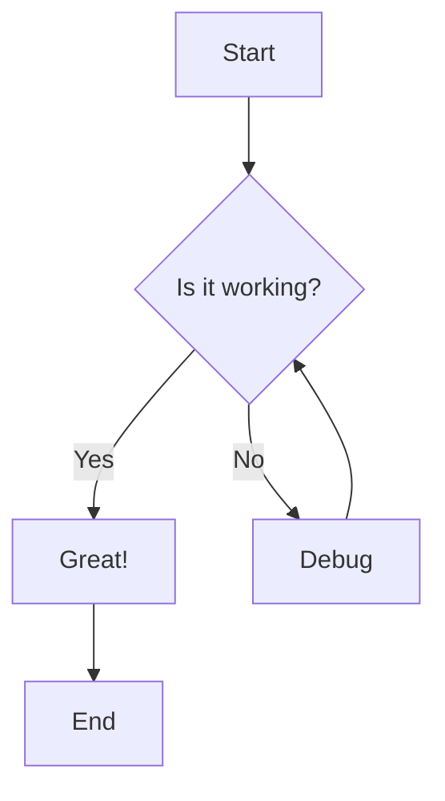

# Markdown Examples

This page demonstrates Markdown basic syntax and some of the built-in markdown extensions provided by VitePress.

## Basic Syntax

### Headings

```md
# H1 Heading
## H2 Heading
### H3 Heading
#### H4 Heading
##### H5 Heading
###### H6 Heading
```

### Emphasis

You can use **bold text**, *italic text*, or ***bold and italic text***.

You can also use __bold__ and _italic_ with underscores.

~~Strikethrough~~ is also supported.

### Lists

**Unordered List:**

- Item 1
- Item 2
  - Nested item 2.1
  - Nested item 2.2
- Item 3

**Ordered List:**

1. First item
2. Second item
   1. Nested item 2.1
   2. Nested item 2.2
3. Third item

### Links and Images

[Link to VitePress](https://vitepress.dev)


### Blockquotes

> This is a blockquote.
>
> It can span multiple paragraphs.
>
> > And can be nested.

### Tables

| Header 1 | Header 2 | Header 3 |
| -------- | -------- | -------- |
| Cell 1   | Cell 2   | Cell 3   |
| Cell 4   | Cell 5   | Cell 6   |

**Aligned Tables:**

| Left Aligned | Center Aligned | Right Aligned |
| :----------- | :------------: | ------------: |
| Left         | Center         | Right         |
| Text         | Text           | Text          |

### Horizontal Rule

```md
---
```

## Code Highlighting

VitePress provides Code Highlighting powered by [Shiki](https://github.com/shikijs/shiki), with additional features like line-highlighting:

```js{4}
export default {
  data () {
    return {
      msg: 'Highlighted!'
    }
  }
}
```

## Custom Containers

**Input**

```md
::: info
This is an info box.
:::

::: tip
This is a tip.
:::

::: warning
This is a warning.
:::

::: danger
This is a dangerous warning.
:::

::: details
This is a details block.
:::
```

**Output**

::: info
This is an info box.
:::

::: tip
This is a tip.
:::

::: warning
This is a warning.
:::

::: danger
This is a dangerous warning.
:::

::: details
This is a details block.
:::

## Mermaid Diagrams

This template supports Mermaid diagrams for creating flowcharts, sequence diagrams, and more.



## More

Check out the documentation for the [full list of markdown extensions](https://vitepress.dev/guide/markdown).
